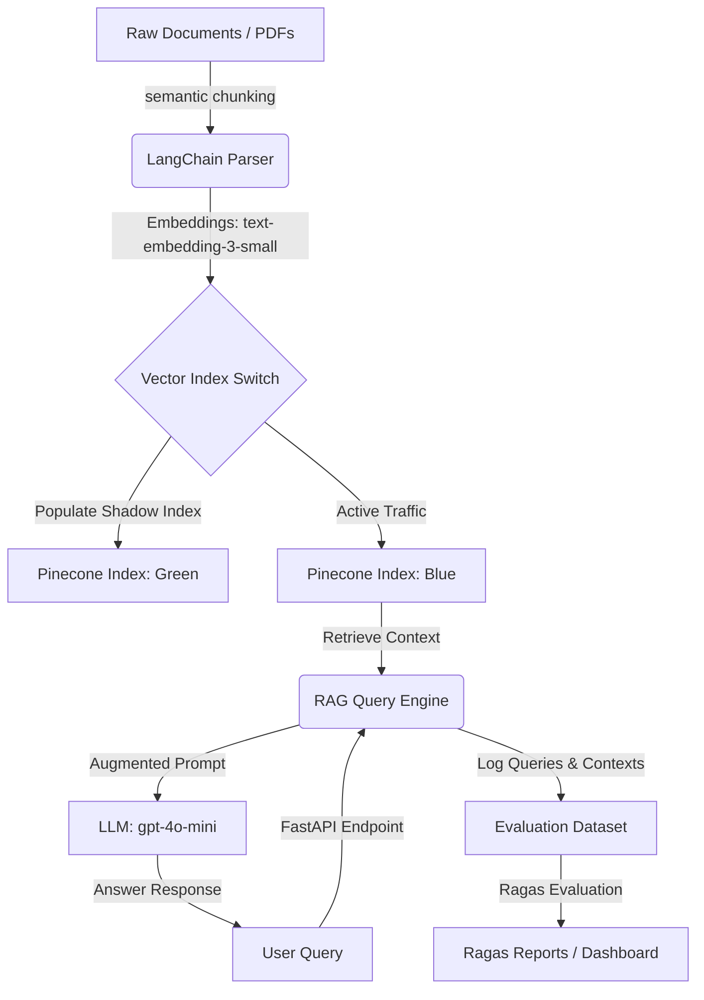

# DocuQuery-RAG Pipeline: Implementation Plan

This document outlines the step-by-step architecture and implementation details for building the **DocuQuery-RAG Pipeline**. This project implements a production-grade Retrieval-Augmented Generation (RAG) system featuring semantic chunking, vector index rotation (blue/green update pattern), and automated evaluations.

---

## 1. System Architecture

The pipeline divides responsibilities into **Ingestion** (offline processing) and **Querying** (online FastAPI serving). It implements **Index Rotation** to guarantee zero-downtime updates.



---

## 2. Directory Structure

```text
docuquery-rag/
├── config.py             # App configurations (API keys, index names)
├── requirements.txt      # Python dependencies
├── Dockerfile            # FastAPI App containerizer
├── docker-compose.yml    # App + local storage/cache composition
├── src/
│   ├── __init__.py
│   ├── main.py           # FastAPI entrypoint (Routes and Middleware)
│   ├── ingest/
│   │   ├── chunker.py    # Semantic chunking logic
│   │   └── uploader.py   # Vector DB upload & Index Rotation coordinator
│   ├── query/
│   │   ├── engine.py     # Retrieval and generation orchestrator
│   │   └── reranker.py   # Cohere/FlashRank reranker integration
│   └── eval/
│       └── evaluator.py  # Ragas validation runner
└── data/
    └── eval_dataset.json # Ragas ground-truth evaluation set
```

---

## 3. Implementation Steps

### Phase 1: Semantic Chunking Engine (`src/ingest/chunker.py`)
1. Read PDFs and text documents using LangChain's loaders (`PyPDFDirectoryLoader`).
2. Utilize LangChain's **`SemanticChunker`** (backed by OpenAI Embeddings) to detect natural transitions in text flow, breaking chunks based on embedding similarity distance thresholds rather than hard character limits.

### Phase 2: Vector Index Rotation Pattern (`src/ingest/uploader.py`)
1. Maintain two indices in Pinecone (e.g., `docuquery-blue` and `docuquery-green`).
2. Implement a rotation sequence during document re-indexing:
   - Identify the *inactive* index (the "shadow" index).
   - Flush and upload new embeddings into the *inactive* index.
   - Run validation tests on the *inactive* index.
   - Update a configuration value or Redis key pointing the API to the newly updated index.
   - The old active index now becomes the inactive shadow index.

### Phase 3: Query & Generation Service (`src/query/engine.py`)
1. Create a FastAPI service to handle query post requests.
2. Formulate hybrid searches (combining Pinecone dense vectors with BM25 sparse vectors for semantic & keyword matching).
3. Apply a reranking step using `FlashRank` or `CohereRerank` to filter the top retrieved documents.
4. Supply context to a ChatModel (e.g., GPT-4o-mini or Claude-3-Haiku) to generate the final response.

### Phase 4: Automated Evaluation Suite (`src/eval/evaluator.py`)
1. Prepare a synthetic or hand-crafted Q&A validation set containing `question` and `ground_truth`.
2. Write an evaluation task running weekly or post-ingestion:
   - For every question in the dataset, query the active index to collect `answer` and `contexts`.
   - Use **Ragas** metrics: `faithfulness`, `answer_relevance`, `context_recall`, and `context_precision`.
   - Log evaluation scores to monitor performance degradation.

---

## 4. Key Code Snippets

### Semantic Chunking (`src/ingest/chunker.py`)
```python
from langchain_community.document_loaders import PyPDFDirectoryLoader
from langchain_experimental.text_splitter import SemanticChunker
from langchain_openai import OpenAIEmbeddings

def process_documents_semantically(directory_path: str):
    loader = PyPDFDirectoryLoader(directory_path)
    raw_docs = loader.load()
    
    # Semantic Chunker divides text based on semantic shifts
    embeddings = OpenAIEmbeddings(model="text-embedding-3-small")
    text_splitter = SemanticChunker(
        embeddings, 
        breakpoint_threshold_type="percentile"
    )
    
    chunks = text_splitter.split_documents(raw_docs)
    return chunks
```

### Vector Index Rotation Logic (`src/ingest/uploader.py`)
```python
import os
from pinecone import Pinecone

class IndexRotator:
    def __init__(self):
        self.pc = Pinecone(api_key=os.getenv("PINECONE_API_KEY"))
        self.blue_index_name = "docuquery-blue"
        self.green_index_name = "docuquery-green"

    def get_active_index_name(self, redis_client) -> str:
        # Fetch current target index from config storage (e.g., Redis or file)
        active = redis_client.get("active_index")
        return active.decode("utf-8") if active else self.blue_index_name

    def run_rotation_upload(self, chunks, redis_client):
        current_active = self.get_active_index_name(redis_client)
        shadow_index_name = (
            self.green_index_name if current_active == self.blue_index_name 
            else self.blue_index_name
        )
        
        print(f"Uploading vectors to shadow index: {shadow_index_name}...")
        shadow_index = self.pc.Index(shadow_index_name)
        
        # 1. Clear shadow index
        shadow_index.delete(delete_all=True)
        
        # 2. Upload vectors to shadow index (batch insert)
        # (Uploader code here mapping chunks to embeddings and upserting)
        
        # 3. Swap the pointer in Redis to update production target instantly
        redis_client.set("active_index", shadow_index_name)
        print(f"Index successfully rotated! Active index is now: {shadow_index_name}")
```

### Ragas Pipeline Evaluation (`src/eval/evaluator.py`)
```python
import pandas as pd
from datasets import Dataset
from ragas import evaluate
from ragas.metrics import (
    faithfulness,
    answer_relevance,
    context_recall,
    context_precision,
)

def evaluate_rag_pipeline(qa_dataset, query_engine_fn):
    """
    qa_dataset: list of dicts with 'question' and 'ground_truth' keys
    """
    eval_data = []
    
    for item in qa_dataset:
        question = item['question']
        # Query our live RAG engine
        result = query_engine_fn(question)
        
        eval_data.append({
            "question": question,
            "answer": result["answer"],
            "contexts": [doc.page_content for doc in result["source_documents"]],
            "ground_truth": item["ground_truth"]
        })
        
    # Convert data format to HuggingFace Dataset required by Ragas
    df = pd.DataFrame(eval_data)
    dataset = Dataset.from_pandas(df)
    
    # Compute Ragas Metrics
    scores = evaluate(
        dataset=dataset,
        metrics=[
            faithfulness,
            answer_relevance,
            context_recall,
            context_precision
        ]
    )
    
    print("RAG Pipeline Performance Scores:")
    print(scores)
    return scores
```

---

## 5. Running the Pipeline

1. **Start Redis and App Environment**:
   ```bash
   docker-compose up -d
   ```
2. **Execute Ingestion & Rotation**:
   Run the ingestion script to process source files and update vector stores without interrupting live users:
   ```bash
   python src/ingest/uploader.py
   ```
3. **Run Ragas Verification**:
   Trigger pipeline health analysis checks:
   ```bash
   python src/eval/evaluator.py
   ```
