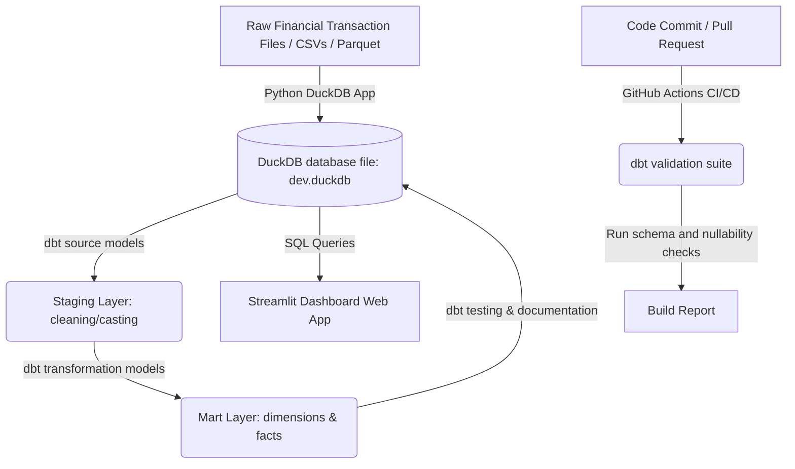

# FinInsight Analytics Pipeline: Implementation Plan

This document outlines the step-by-step architecture and implementation details for building the **FinInsight Analytics Pipeline**. This project leverages the Modern Data Stack (MDS) in-a-box to process transactional records using DuckDB, dbt, and Streamlit.

---

## 1. System Architecture

FinInsight utilizes **DuckDB** as a high-performance analytics query engine, **dbt** for transformations and schema validation, and **Streamlit** for front-end analytics representation.



---

## 2. Directory Structure

```text
fininsight-pipeline/
├── .github/
│   └── workflows/
│       └── ci_cd.yml       # GitHub Actions workflow for dbt testing
├── dbt_project/            # dbt directory
│   ├── dbt_project.yml     # Project metadata and configuration
│   ├── profiles.yml        # DuckDB database adapter settings
│   ├── models/
│   │   ├── staging/
│   │   │   ├── schema.yml  # Source & staging schemas + testing rules
│   │   │   ├── stg_transactions.sql
│   │   │   └── stg_accounts.sql
│   │   └── marts/
│   │       ├── fct_transactions.sql
│   │       └── dim_accounts.sql
│   └── tests/
│       └── assert_positive_transaction_amount.sql
├── src/
│   ├── ingest.py           # Ingestion layer load utility
│   └── app.py              # Streamlit dashboard script
├── requirements.txt        # Python packages
└── README.md
```

---

## 3. Implementation Steps

### Phase 1: Local Data Ingestion (`src/ingest.py`)
1. Create a Python script that loads transaction data (CSV, Parquet, or JSON formats) and writes it into a raw staging database inside a local **DuckDB** database file (`dev.duckdb`).
2. Implement schema enforcement at the ingestion phase to prevent corrupt source structures.

### Phase 2: Analytics Engineering Setup (`dbt_project/`)
1. Install `dbt-duckdb`.
2. Configure `profiles.yml` to set the connection adapter to read `dev.duckdb`.
3. Create staging models (`stg_transactions.sql`) to clean timestamps, cast currencies, and parse flags.
4. Establish core business logic tables:
   - `fct_transactions`: Chronological ledger containing category flags, transaction totals, and foreign keys.
   - `dim_accounts`: Snapshot containing current balances and user profile associations.

### Phase 3: Transformations and Schema Testing (`models/staging/schema.yml`)
1. Apply assertions within dbt:
   - Ensure all transaction IDs are `unique` and `not_null`.
   - Implement custom test files checking that withdrawal transactions have negative values and deposits have positive values.

### Phase 4: Streamlit Dashboard App (`src/app.py`)
1. Design an interactive application connecting to the generated DuckDB database in read-only mode to prevent lock conflicts.
2. Build panels for:
   - Total spending summary and monthly savings rates.
   - Dynamic charts displaying category break-downs (e.g. food, utilities, rent).
   - Anomaly filters catching transactions exceeding standard threshold limits.

### Phase 5: CI/CD Pipeline (`.github/workflows/ci_cd.yml`)
1. Orchestrate a GitHub Actions runner that triggers on every pull request.
2. Set up Python environment, install `requirements.txt`, compile dbt models, and execute `dbt test` to ensure that incoming schema adjustments do not corrupt historical transaction counts.

---

## 4. Key Code Snippets

### DuckDB Ingestion Layer (`src/ingest.py`)
```python
import duckdb
import pandas as pd

def ingest_raw_files(db_path: str, raw_csv_path: str):
    # Connect to DuckDB file (will create it if it doesn't exist)
    con = duckdb.connect(db_path)
    
    # Efficiently load CSV file straight into a raw table
    con.execute(f"""
        CREATE TABLE IF NOT EXISTS raw_transactions AS 
        SELECT * FROM read_csv_auto('{raw_csv_path}');
    """)
    print("Ingestion complete. Current row count in raw_transactions:")
    print(con.execute("SELECT COUNT(*) FROM raw_transactions;").fetchone()[0])
    con.close()

if __name__ == "__main__":
    ingest_raw_files("dev.duckdb", "data/raw_transactions.csv")
```

### dbt Schema Configuration (`dbt_project/models/staging/schema.yml`)
```yaml
version: 2

sources:
  - name: main
    tables:
      - name: raw_transactions

models:
  - name: stg_transactions
    description: "Staging model parsing raw transactions data."
    columns:
      - name: transaction_id
        tests:
          - unique
          - not_null
      - name: account_id
        tests:
          - not_null
```

### dbt Staging Transform (`dbt_project/models/staging/stg_transactions.sql`)
```sql
{{ config(materialized='view') }}

with source as (
    select * from {{ source('main', 'raw_transactions') }}
)

select
    cast(id as varchar) as transaction_id,
    cast(account_id as varchar) as account_id,
    cast(transaction_date as date) as transaction_date,
    cast(amount as decimal(18, 2)) as amount,
    lower(trim(category)) as category_name,
    cast(is_pending as boolean) as is_pending
from source
```

### Streamlit Application (`src/app.py`)
```python
import streamlit as st
import duckdb
import pandas as pd
import plotly.express as px

st.set_page_config(page_title="FinInsight Analytics", layout="wide")
st.title("💼 FinInsight Transactions Summary")

# Establish read-only connection (avoids multi-writer concurrency errors)
con = duckdb.connect(database="dev.duckdb", read_only=True)

# Query core business models built by dbt
df_trans = con.execute("SELECT * FROM fct_transactions;").fetchdf()

# Metrics Calculations
total_spent = df_trans[df_trans['amount'] < 0]['amount'].sum()
total_deposit = df_trans[df_trans['amount'] > 0]['amount'].sum()

col1, col2 = st.columns(2)
with col1:
    st.metric(label="Total Outflow", value=f"${abs(total_spent):,.2f}")
with col2:
    st.metric(label="Total Inflow", value=f"${total_deposit:,.2f}")

# Expense Category breakdown
df_outflow = df_trans[df_trans['amount'] < 0].copy()
df_outflow['amount'] = df_outflow['amount'].abs()
category_summary = df_outflow.groupby('category_name')['amount'].sum().reset_index()

fig = px.pie(category_summary, values='amount', names='category_name', title="Spending Distribution")
st.plotly_chart(fig, use_container_width=True)
```

### GitHub Actions CI/CD Workflow (`.github/workflows/ci_cd.yml`)
```yaml
name: dbt CI/CD Integration

on:
  pull_request:
    branches:
      - main

jobs:
  test_pipeline:
    runs-on: ubuntu-latest
    steps:
      - name: Checkout Code
        uses: actions/checkout@v3

      - name: Set up Python
        uses: actions/setup-python@v4
        with:
          python-version: '3.10'

      - name: Install dependencies
        run: |
          pip install dbt-duckdb duckdb pandas

      - name: Seed database for testing
        run: |
          python src/ingest.py # Creates temporary dev.duckdb for testing runs

      - name: Run dbt transformation models
        working-directory: ./dbt_project
        run: |
          dbt run --profiles-dir . --target dev

      - name: Run dbt tests
        working-directory: ./dbt_project
        run: |
          dbt test --profiles-dir . --target dev
```

---

## 5. Running the Project

To set up the dashboard:
1. Load raw CSV data into DuckDB:
   ```bash
   python src/ingest.py
   ```
2. Build transformation models and run schema validation checks:
   ```bash
   cd dbt_project
   dbt run
   dbt test
   ```
3. Start the dashboard front-end:
   ```bash
   cd ..
   streamlit run src/app.py
   ```
