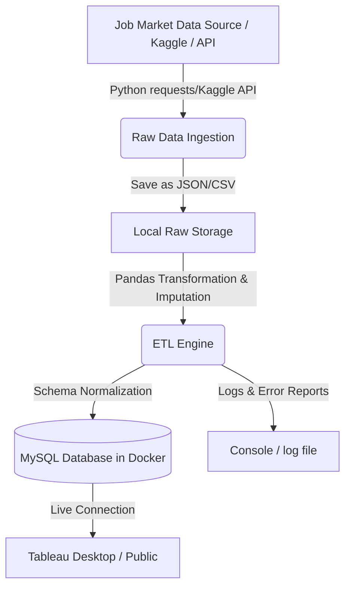
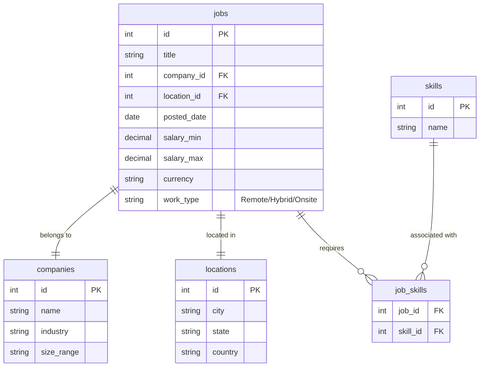

# LaborMarket-ETL Pipeline: Implementation Plan

This document outlines the step-by-step architecture and implementation details for building the **LaborMarket-ETL Pipeline**. This project automates the ingestion, transformation, and storage of job market data for downstream salary analytics.

---

## 1. System Architecture

The pipeline uses a local-first engineering approach, containerizing database services and scheduling ingestion using Python.



---

## 2. Directory Structure

```text
labormarket-etl/
├── config/
│   └── database.ini       # MySQL connection parameters
├── data/
│   ├── raw/               # Landing zone for raw files
│   └── processed/         # Archive zone for processed logs
├── db/
│   ├── init.sql           # Schema initialization and normalization rules
│   └── views.sql          # Analytics views for Tableau optimization
├── src/
│   ├── __init__.py
│   ├── db_connector.py    # Database connection manager (SQLAlchemy)
│   ├── extract.py         # Data scraping / ingestion script
│   ├── transform.py       # Pandas cleaning & imputation logic
│   └── load.py            # Bulk loading and normalization scripts
├── docker-compose.yml     # Multi-container orchestration (MySQL + Python ETL)
├── Dockerfile             # Custom container for the ETL runner
├── requirements.txt       # Python dependencies
└── main.py                # Pipeline orchestrator entry point
```

---

## 3. Database Design (MySQL)

To keep query speeds optimal and avoid anomalies, the target database follows the 3rd Normal Form (3NF).



---

## 4. Implementation Steps

### Phase 1: Infrastructure and DB Setup
1. **Create the `docker-compose.yml` file**: Sets up the MySQL database container with persistent volumes.
2. **Write the Schema Initializer (`db/init.sql`)**: Defines tables, foreign keys, constraints, and indexes.

### Phase 2: Ingestion & Extraction (`src/extract.py`)
1. Ingest datasets using either an open API (like Adzuna or GitHub Jobs archives) or a public Kaggle dataset (e.g., LinkedIn Job Postings).
2. Save raw payloads with timestamps in `data/raw/` to ensure idempotency (re-running does not corrupt the source data).

### Phase 3: Transformation Engine (`src/transform.py`)
1. **Data Cleaning**: Remove duplicates, handle mismatched datatypes, and standardize dates.
2. **Salary Imputation**:
   - For missing salaries, use Pandas' `groupby().transform()` to impute salaries using the median salary for similar job titles in the same location.
3. **Skill Parsing**: Use regex or spaCy parser to extract programming languages and technologies from the job description fields.

### Phase 4: Schema Normalization & Loading (`src/load.py`)
1. Check if the company or location already exists in their respective tables. If not, insert and fetch the generated ID.
2. Insert job details and associate the generated ID with the junction table `job_skills`.
3. Use SQLAlchemy `bulk_insert_mappings` for fast batch loading.

### Phase 5: Tableau Dashboard Design
1. Create a specialized database view to flatten data: `v_salary_analytics` containing joined columns.
2. Build 3 core dashboard sheets:
   - **Salary Distribution**: Boxplot of salaries based on Job Role and Experience Level.
   - **Skill Density**: Bubble chart showing the occurrence of key skills vs. median salary.
   - **Geographic Demand**: Interactive map pointing out high-paying hubs.

---

## 5. Key Code Snippets

### Docker Orchestration (`docker-compose.yml`)
```yaml
version: '3.8'

services:
  mysql-db:
    image: mysql:8.0
    container_name: labor_market_db
    restart: always
    environment:
      MYSQL_DATABASE: labor_market
      MYSQL_ROOT_PASSWORD: root_password_123
      MYSQL_USER: etl_user
      MYSQL_PASSWORD: etl_password_123
    ports:
      - "3306:3306"
    volumes:
      - mysql_data:/var/lib/mysql
      - ./db/init.sql:/docker-entrypoint-initdb.d/init.sql

  etl-runner:
    build: .
    container_name: etl_pipeline
    depends_on:
      - mysql-db
    environment:
      - DB_HOST=mysql-db
      - DB_PORT=3306
      - DB_NAME=labor_market
      - DB_USER=etl_user
      - DB_PASSWORD=etl_password_123
    volumes:
      - ./data:/app/data

volumes:
  mysql_data:
```

### Database Schema (`db/init.sql`)
```sql
CREATE DATABASE IF NOT EXISTS labor_market;
USE labor_market;

CREATE TABLE IF NOT EXISTS companies (
    id INT AUTO_INCREMENT PRIMARY KEY,
    name VARCHAR(255) UNIQUE NOT NULL,
    industry VARCHAR(100),
    size_range VARCHAR(50)
);

CREATE TABLE IF NOT EXISTS locations (
    id INT AUTO_INCREMENT PRIMARY KEY,
    city VARCHAR(100) NOT NULL,
    state VARCHAR(100),
    country VARCHAR(100) NOT NULL,
    CONSTRAINT uq_location UNIQUE (city, state, country)
);

CREATE TABLE IF NOT EXISTS jobs (
    id INT AUTO_INCREMENT PRIMARY KEY,
    title VARCHAR(255) NOT NULL,
    company_id INT,
    location_id INT,
    posted_date DATE,
    salary_min DECIMAL(12, 2),
    salary_max DECIMAL(12, 2),
    currency VARCHAR(10),
    work_type VARCHAR(50),
    FOREIGN KEY (company_id) REFERENCES companies(id),
    FOREIGN KEY (location_id) REFERENCES locations(id)
);

CREATE TABLE IF NOT EXISTS skills (
    id INT AUTO_INCREMENT PRIMARY KEY,
    name VARCHAR(100) UNIQUE NOT NULL
);

CREATE TABLE IF NOT EXISTS job_skills (
    job_id INT,
    skill_id INT,
    PRIMARY KEY (job_id, skill_id),
    FOREIGN KEY (job_id) REFERENCES jobs(id) ON DELETE CASCADE,
    FOREIGN KEY (skill_id) REFERENCES skills(id) ON DELETE CASCADE
);
```

### Salary Imputation Logic (`src/transform.py`)
```python
import pandas as pd
import numpy as np

def clean_and_impute_salaries(df: pd.DataFrame) -> pd.DataFrame:
    # Standardize salary numeric values
    df['salary_min'] = pd.to_numeric(df['salary_min'], errors='coerce')
    df['salary_max'] = pd.to_numeric(df['salary_max'], errors='coerce')
    
    # Impute missing salaries with the median salary for the specific job title
    df['salary_min'] = df['salary_min'].fillna(
        df.groupby('title')['salary_min'].transform('median')
    )
    df['salary_max'] = df['salary_max'].fillna(
        df.groupby('title')['salary_max'].transform('median')
    )
    
    # Fallback to general median if title is unique or missing
    overall_min = df['salary_min'].median()
    overall_max = df['salary_max'].median()
    
    df['salary_min'] = df['salary_min'].fillna(overall_min if not np.isnan(overall_min) else 0)
    df['salary_max'] = df['salary_max'].fillna(overall_max if not np.isnan(overall_max) else 0)
    
    return df
```

---

## 6. Validation and Running the Project

To run this pipeline:
1. Spin up the MySQL container:
   ```bash
   docker-compose up -d mysql-db
   ```
2. Build and run the ETL script:
   ```bash
   docker-compose up --build etl-runner
   ```
3. Connect Tableau to `localhost:3306` using the credentials defined in the Docker compose file to start visualizing your data!
